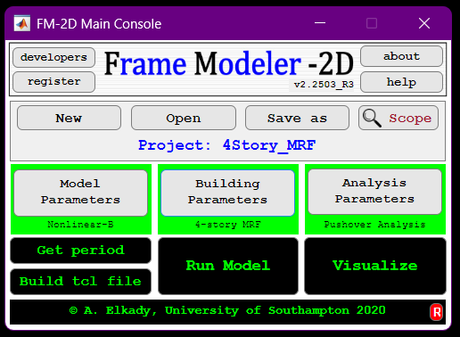

  

--------------

## FM-2D
Frame Modeler 2D is an open-source MATLAB-based computational platform for modeling and analyzing building assets in OpenSEES using state-of-the-art modeling and dynamic analyses guidelines. The current version supports steel MRFs, CBFs and EBFs.

--> Curent compiled installer executable: v1.2308

--> Video tutorials on YouTube [here](https://www.youtube.com/playlist?list=PLz_XdUL-6Y_m10fBEMmzPKqI00wdzbDUN)

## Important Notes

- Make sure you run the FM-2D.exe, which is located in this directory "C:\Program Files\University of Southampton\FM_2D\application", as admistrator.

- If you encouter issues running OpenSees, try downloading the "lib" folder (available in FM-2D repo) and then place it in the following folder on your PC: C:\Program Files\University of Southampton\FM_2D.

- Users, and particularly those who plan on collaborating and contributing to FM-2D base code, are highly encouraged to 1) install GitHub Desktop Application, and 2) FORK this repository to thier own computer. This will allow the user to recieve all updates and bug fixes on time. If you are new to GitHub, please check the links below for a quick tutorial on how to fork repositories.

- PULL requests will be considered while giving credit to contributers. To fork the repo click on the FORK at the top of this page.

--> Brief outline on forking, we suggest this [link](https://www.atlassian.com/git/tutorials/comparing-workflows/forking-workflow)

--> Full introduction to Git and GitHub, we suggest watching this [playlist](https://www.youtube.com/playlist?list=PLRqwX-V7Uu6ZF9C0YMKuns9sLDzK6zoiV)

## Citation
Elkady, A. (2022). "FM-2D: Open-Source Platform for the Numerical Modeling and Seismic Analysis of Buildings." SoftwareX, 17(1), DOI: [10.1016/j.softx.2021.100927](https://www.sciencedirect.com/science/article/pii/S2352711021001679).

** source code is being updated and will be re-uploaded soon **
